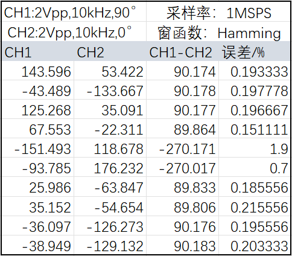

# STM32H743 双ADC同步采样与FFT相位差计算

Dual ADC synchronous sampling and phase difference calculation using FFT on STM32H7

## 简介

本工程演示了如何使用STM32H7系列单片机的**双ADC同步采样模式**，结合HAL库和CubeMX进行配置，并实现基于CMSIS-DSP库的FFT函数的**信号相位差计算**。测试结果：



最大采样率可以拉到1.5MHz左右。

## 功能

* 基于HAL库和CubeMX配置STM32H743双ADC同步采样
* 实现两个通道的同步采样和数据采集
* 利用FFT对采样数据进行频域分析（默认1024点，可以根据需要自行修改源代码）
* 计算两个信号的相位差

## 硬件信息

- MCU型号：STM32H743VIT6
- 项目中配置的引脚如下：
  - E1：按键输入，按下开启采样
  - E3：连接到板上LED，用于指示案件是否功能正常
  - PC0：ADC1通道，单端模式，16-bit
  - PB1：ADC2通道，单端模式，16-bit
  - PC6：USART6_TX 用于在串口上显示计算结果
  - PC7：USART6_RX 用于在串口上显示计算结果
  - PA13和PA14用于DEBUG

双ADC模式的实现原理以及 CubeMX 的具体配置详见[这篇博客](https://www.cnblogs.com/Banyee/p/18340625#5332728)。

## 软件信息

以下为本人使用的软件版本，更高的版本应该也能正常使用。

- STM32CubeMX Version 6.9.2
- MDK-ARM Plus Version: 5.24.1

## 快速开始

### 1.克隆仓库

可以直接`Download ZIP`，也可以使用Git：在 Git Bash 输入以下命令

```bash
git clone git@github.com:banyee19/STM32H743-dual-ADC-FFT-phase-diff.git
```

### 2.生成代码

打开项目目录下的`H743_dual_ADC_synchronous_sample.ioc`，Toolchain/IDE 选择`MDK-ARM`，然后点击`GENERATE CODE`生成代码，然后烧录即可。如果出现乱码，请检查你的编码是否被正确地设置为UTF-8。

### 3.运行程序

本工程默认使用USART6发送数据，上电后按下按键`PE1`开始采集数据，采集完毕后执行相位差计算，并把计算的结果发给串口。

## 代码结构

本项目的核心文件有两个：`Phase.c`和`Phase.h`，位于`H743_dual_ADC_synchronous_sample\Custom`目录下的`src`和`inc`文件夹中。整个计算需要用到的大多数变量、宏定义等都已经定义在了这两个文件中，因此在`main.c`中只需要引入一个头文件即可（不包括串口重定向）：

```c
#include "Phase.h"
```

最核心的函数有以下三个：

```c
// ADC 初始化函数
void PhaseCalculate_ADC_Init(ADC_HandleTypeDef *hadc1, ADC_HandleTypeDef *hadc2);
// 处理ADC原始数据的函数，如果需要获取采样电压波形信息可以调用此函数
void Process_ADC_RawData(void);
// 获取相位差，qi内部调用了 Process_ADC_RawData.
float32_t Get_PhaseDifference(void);
```

- `PhaseCalculate_ADC_Init`：完成ADC的初始化，包括执行ADC校准、启动双ADC模式、初始化DMA采样。
- `Process_ADC_RawData`：用于处理 ADC 采样原始数据的函数，只在 ADC 采样完毕后可以被调用。
- `Get_PhaseDifference`：获取 ADC1 和 ADC2 的相位差（单位：度）

具体的实现思路详见`Phase.c`。


